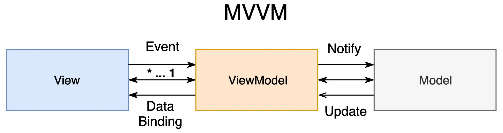

# MVVM

## Model
Model classes are non-visual classes that encapsulate the app's data. Therefore, the model can be thought of as representing the app's [domain model](https://en.wikipedia.org/wiki/Domain_model), which usually includes a data model along with business and [validation](https://en.wikipedia.org/wiki/Data_validation) logic.

## View
The view is responsible for defining the structure, layout, and appearance of what the user sees on screen. 

* in iOS, Viewcontroller is also treat as View

## View Model
The view model implements properties and commands to which the view can data bind to, and notifies the view of any state changes through change notification events.

## Mechanism

1. User Interaction: The process starts when the user interacts with the View (UI). This interaction can include actions such as clicking a button, entering data in a form, or selecting an item from a list.

2. View: The View layer is responsible for rendering the UI and capturing user input. It consists of visual elements such as buttons, textboxes, and labels. When the user interacts with the View, it notifies the corresponding ViewModel.

3. ViewModel: The ViewModel acts as a mediator between the View and the Model. It contains the presentation logic and state of the View. When the View notifies the ViewModel about a user interaction, the ViewModel processes the input, performs necessary business logic, and updates the state of the View.

4. Model: The Model represents the data and business logic of the application. It encapsulates the data sources, such as databases or web services, and provides methods to manipulate and retrieve data. The ViewModel interacts with the Model to fetch or update data as needed.

5. Data Binding: The MVVM pattern often utilizes data binding techniques to establish a connection between the View and the ViewModel. This allows automatic synchronization of data between the two layers. When the ViewModel updates its state, the corresponding properties in the View are automatically updated, ensuring a consistent user interface.

6. Update View: After the ViewModel performs any necessary data manipulation or retrieval, it updates the View with the new data or triggers UI changes. This can involve updating UI elements, showing or hiding components, or displaying error messages.

7. Data Validation: The ViewModel may also perform data validation by checking the input values provided by the user. It ensures that the data entered by the user is valid before further processing or updating the Model.

8. Model Update: If the ViewModel needs to update the underlying Model based on user actions or business logic, it interacts with the Model layer to perform the necessary operations. This can include saving data, retrieving additional data, or making requests to external services.

## Pros of MVVM

- Separation of concerns, making the codebase modular and maintainable.
- Improved testability and easier unit testing.
- Reusability of ViewModels for different Views.
- Increased productivity with data binding and automatic UI updates.
- Facilitates collaboration between designers and developers.

## Cons of MVVM:

- Introduction of complexity compared to simpler architectures.
- Learning curve for developers new to the pattern.
- Potential performance overhead depending on the implementation.
    - for this Simple MVVM Memo app, MVVM might be not effective architecture
- Framework limitations and potential dependencies.
- Debugging complexity due to the separation of concerns.

# Reference

https://tech.olx.com/clean-architecture-and-mvvm-on-ios-c9d167d9f5b3

https://medium.com/@abhilash.mathur1891/mvvm-in-ios-swift-aa1448a66fb4

https://learn.microsoft.com/en-us/xamarin/xamarin-forms/enterprise-application-patterns/mvvm